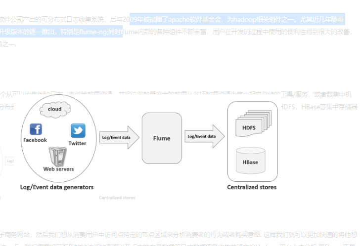
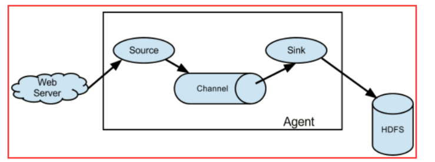
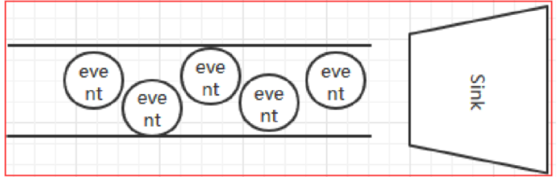
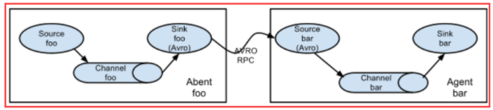
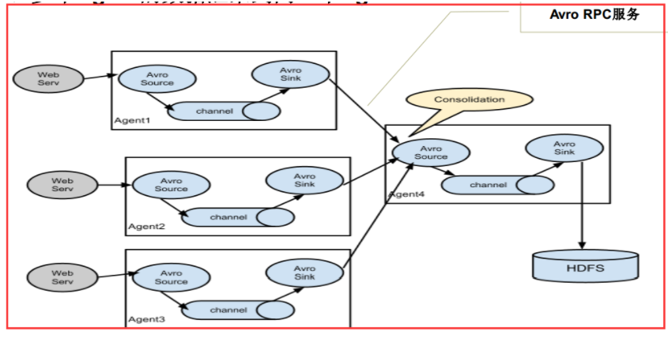
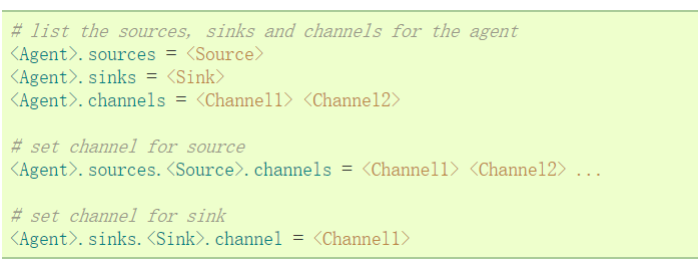
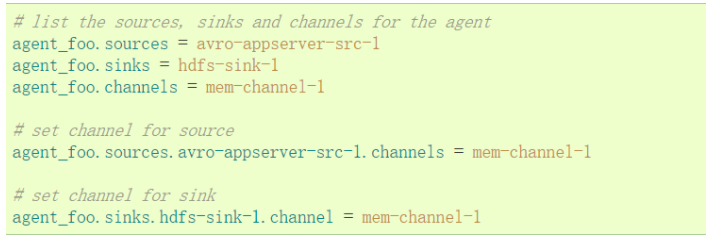
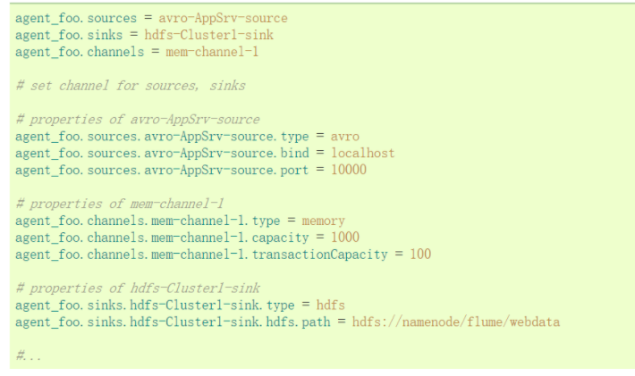

* content
{:toc}
### 什么是Flume

apache Flume 是一个从可以收集例如日志，事件等数据资源，并将这些数量庞大的数据从各项数据资源中集中起来存储的工具/服务，或者数集中机制。flume具有高可用，分布式，配置工具，其设计的原理也是基于将数据流，如日志数据从各种网站服务器上汇集起来存储到HDFS，HBase等集中存储器中。其结构如下图所示：

Flume是一个分布式，可靠，高可用的海量日志聚合系统，支持在系统中定制各类数据发送方，用于收集数据；同时，Flume提供对数据的简单处理，并写到各种数据接收方的能力。

### Flume的特点

flume的数据流由事件(Event)贯穿始终。事件是Flume的基本数据单位，它携带日志数据(字节数组形式)并且携带有头信息，这些Event由Agent外部的Source生成，当Source捕获事件后会进行特定的格式化，然后Source会把事件推入(单个或多个)Channel中。你可以把Channel看作是一个缓冲区，它将保存事件直到Sink处理完该事件。Sink负责持久化日志或者把事件推向另一个Source。

1. flume的可靠性 
   　　当节点出现故障时，日志能够被传送到其他节点上而不会丢失。Flume提供了三种级别的可靠性保障，从强到弱依次分别为：end-to-end（收到数据agent首先将event写到磁盘上，当数据传送成功后，再删除；如果数据发送失败，可以重新发送。），Store on failure（这也是scribe采用的策略，当数据接收方crash时，将数据写到本地，待恢复后，继续发送），Besteffort（数据发送到接收方后，不会进行确认）。
2. flume的可恢复性
   　　还是靠Channel。推荐使用FileChannel，事件持久化在本地文件系统里(性能较差)。
### Flume的核心概念

　　Client：Client生产数据，运行在一个独立的线程。

　　Event： 一个数据单元，消息头和消息体组成。（Events可以是日志记录、 avro 对象等。）
　　Flow： Event从源点到达目的点的迁移的抽象。
　　Agent： 一个独立的Flume进程，包含组件Source、 Channel、 Sink。（Agent使用JVM 运行Flume。每台机器运行一个agent，但是可以在一个agent中包含

　　　　　　多个sources和sinks。）
　　Source： 数据收集组件。（source从Client收集数据，传递给Channel）
　　Channel： 中转Event的一个临时存储，保存由Source组件传递过来的Event。（Channel连接 sources 和 sinks ，这个有点像一个队列。）
　　Sink： 从Channel中读取并移除Event， 将Event传递到FlowPipeline中的下一个Agent（如果有的话）（Sink从Channel收集数据，运行在一个独立线程。）

### Flume的体系结构

### Source

ource是数据的收集端，负责将数据捕获后进行特殊的格式化，将数据封装到事件（event） 里，然后将事件推入Channel中。

　　Flume提供了各种source的实现，包括Avro Source、Exce Source、Spooling Directory Source、NetCat Source、Syslog Source、Syslog TCP Source、Syslog UDP Source、HTTP Source、HDFS Source，etc。如果内置的Source无法满足需要， Flume还支持自定义Source。

### Channel

Channel是连接Source和Sink的组件，大家可以将它看做一个数据的缓冲区（数据队列），它可以将事件暂存到内存中也可以持久化到本地磁盘上， 直到Sink处理完该事件。

Flume对于Channel，则提供了Memory Channel、JDBC Chanel、File Channel，etc。

　　MemoryChannel可以实现高速的吞吐，但是无法保证数据的完整性。

　　MemoryRecoverChannel在官方文档的建议上已经建义使用FileChannel来替换。

　　FileChannel保证数据的完整性与一致性。在具体配置不现的FileChannel时，建议FileChannel设置的目录和程序日志文件保存的目录设成不同的磁盘，以便提高效率。

### Sink

Flume Sink取出Channel中的数据，进行相应的存储文件系统，数据库，或者提交到远程服务器。

　　Flume也提供了各种sink的实现，包括HDFS sink、Logger sink、Avro sink、File Roll sink、Null sink、HBase sink，etc。

　　Flume Sink在设置存储数据时，可以向文件系统中，数据库中，hadoop中储数据，在日志数据较少时，可以将数据存储在文件系中，并且设定一定的时间间隔保存数据。在日志数据较多时，可以将相应的日志数据存储到Hadoop中，便于日后进行相应的数据分析。

### 单一代理流程

### 多代理流程（多个agent顺序连接）

### 流的合并（多个Agent的数据汇聚到同一个Agent ）

### Flume的单一代理流配置方式

通过一个通道将来源和接收器链接。需要列出源，接收器和通道，为给定的代理，然后指向源和接收器及通道。一个源的实例可以指定多个通道，但只能指定一个接收器实例。格式如下：

实例解析：一个代理名为agent_foo，外部通过avro客户端，并且发送数据通过内存通道给hdfs。在配置文件foo.config的可能看起来像这样:

配置：

