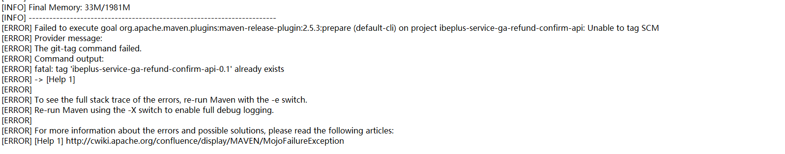
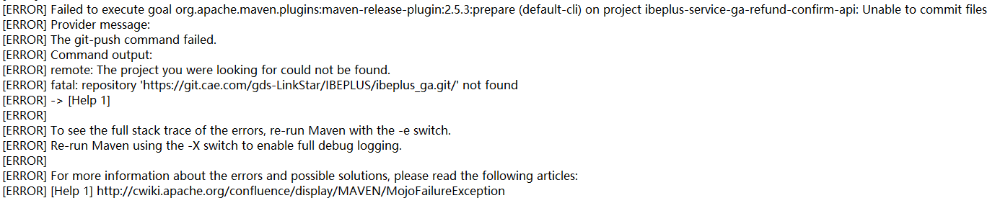
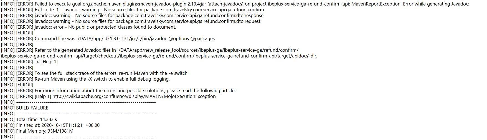

* content
{:toc}
## Release错误指南

出现以上错误，去gitlab上删除tag，然后在服务器上也删除tag，先git tag看一下是否有那个tag，如果有的话，用git tag -d tagName进行删除。

出现以上错误，说明是不能提交文件上去，根据错误原因发现是clone的地址存在问题，检查项目clone的地址进行对比，果然发现项目中scm标签里面的地址出现错误，进行改正即可。

出现以上错误，说明他找不到这些文件，这个时候，就要去看一下项目的实际情况，找到这个项目的这个工程，发现果然开发这个工程的把这个包给写错了，导致出现这个错误。