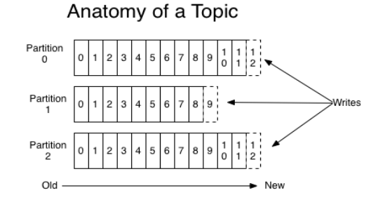
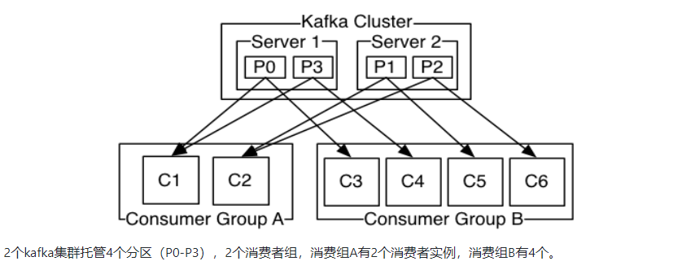

* content
{:toc}

### 什么是kafka

- kafka是用于构建实时数据管道和流应用程序。Apache kafka是消息中间件的一种。举个例子，生产者消费者，生产者生产鸡蛋，消费者消费鸡蛋，生产者生产一个鸡蛋，消费者就消费一个鸡蛋，假设消费者消费鸡蛋的时候噎住了（系统宕机了），生产者还在生产鸡蛋，那新生产的鸡蛋就丢失了。再比如生产者很强劲（大交易量的情况），生产者1秒钟生产100个鸡蛋，消费者1秒钟只能吃50个鸡蛋，那要不了一会，消费者就吃不消了（消息堵塞，最终导致系统超时），消费者拒绝再吃了，”鸡蛋“又丢失了，这个时候我们放个篮子在它们中间，生产出来的鸡蛋都放到篮子里，消费者去篮子里拿鸡蛋，这样鸡蛋就不会丢失了，都在篮子里，而这个篮子就是”kafka“。

- 鸡蛋其实就是“数据流”，系统之间的交互都是通过“数据流”来传输的（就是tcp、https什么的），也称为报文，也叫“消息”。

### 名词解释

producer：生产者，就是它来生产“鸡蛋”的。

consumer：消费者，生出的“鸡蛋”它来消费。

topic：你把它理解为标签，生产者每生产出来一个鸡蛋就贴上一个标签（topic），消费者可不是谁生产的“鸡蛋”都吃的，这样不同的生产者生产出来的“鸡蛋”，消费者就可以选择性的“吃”了。

broker：就是篮子了。

#### Topic

Kafka将消息分门别类，每一类的消息称之为一个主题（Topic）。

#### Producer

发布消息的对象称之为主题生产者（Kafka topic producer）

#### Consumer

订阅消息并处理发布的消息的对象称之为主题消费者（consumers）

#### Broker

已发布的消息保存在一组服务器中，称之为Kafka集群。集群中的每一个服务器都是一个代理（Broker）。 消费者可以订阅一个或多个主题（topic），并从Broker拉数据，从而消费这些已发布的消息。

### 灵魂提问

- kafka节点之间如何复制备份的？
- kafka消息是否会丢失？为什么？
- kafka最合理的配置是什么？
- kafka的leader选举机制是什么？
- kafka对硬件的配置有什么要求？
- kafka的消息保证有几种方式？
- kafka为什么会丢消息？

### kafa作为一个分布式的流平台，关键能力是

1. 发布和订阅消息(流)，在这方面，它类似于一个消息队列或企业消息系统。
2. 以容错(故障转移)的方式存储消息(流)。
3. 在消息流发生时处理它们。

### kafka的优势

1. 构建实时的流数据管道，可靠地获取系统和应用程序之间的数据。
2. 构建实时流的应用程序，对数据流进行转换或反应。

### kafka概念

1. kafka作为一个集群运行在一个或多个服务器上。
2. kafka集群存储的消息是以topic为类别记录的。
3. 每个消息（也叫记录record，我习惯叫消息）是由一个key，一个value和时间戳构成。

### 主题和日志

Topic是发布的消息的类别名，一个topic可以有零个，一个或多个消费者订阅该主题的消息。

对于每个topic，Kafka集群都会维护一个分区log，就像下图中所示：

分区中的消息都被分了一个序列号，称为偏移量，每个分区中偏移量是唯一的。

Kafka集群保持所有的消息，直到它们过期（无论消息是否被消费）。实际上消费者所持有的仅有的元数据就是这个offset（偏移量），也就是说offset由消费者来控制：正常情况当消费者消费消息的时候，偏移量也线性的的增加。但是实际偏移量由消费者控制，消费者可以将偏移量重置为更早的位置，重新读取消息。可以看到这种设计对消费者来说操作自如，一个消费者的操作不会影响其它消费者对此log的处理。

Kafka中采用分区的设计有几个目的。一是可以处理更多的消息，不受单台服务器的限制。Topic拥有多个分区意味着它可以不受限的处理更多的数据。第二，分区可以作为并行处理的单元，稍后会谈到这一点。

### 分布式

Log的分区分布到集群的多个服务器上，每个服务器处理它分到的分区。根据配置每个分区还可以复制其他服务器作为备份容错。每个分区有一个leader，0或多个follower。Leader用来处理此分区的所有的读写请求，follower被动的复制数据。如果leader宕机，其它的一个follower会被推举为新的leader。 一台服务器可能同时是一个分区的leader，另一个分区的follower。 这样可以平衡负载，避免所有的请求都只让一台或者某几台服务器处理。

### 生产者

生产者往某个Topic上发布消息。生产者也负责选择发布到Topic上的哪一个分区。最简单的方式从分区列表中轮流选择。也可以根据某种算法依照权重选择分区。开发者负责如何选择分区的算法。

### 消费者

消息模型分为两种，队列和发布—订阅式。队列的处理方式是一组消费者从服务器读取消息，一条消息只有其中的一个消费者来处理。在发布-订阅模型中，消息被广播给所有的消费者，接收到消息的消费者都可以处理此消息。kafka为这两种模型提供了单一的消费者抽象模型：消费者组。消费者用一个消费者组名标记自己。 一个发布在Topic上消息被分发给此消费者组中的一个消费者。 假如所有的消费者都在一个组中，那么这就变成了queue模型。 假如所有的消费者都在不同的组中，那么就完全变成了发布-订阅模型。

