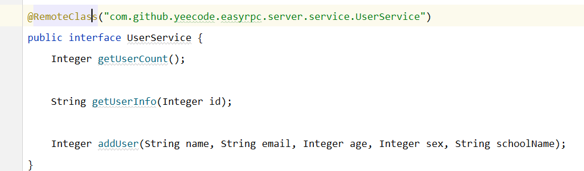
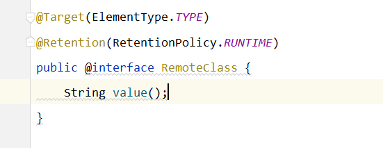

* content
{:toc}
## 

- 如上图所示，@RemoteClass是一个自定义注解，这个自定义注解有什么作用呢？这个时候我们就要点进去看一看这个注解到底是干嘛用的。

- 进去之后发现这个自定义注解上面还有两个注解，我们先分析第一个注解@Target是什么意思。
- @Target其实就是给注解定义一个范围的，也就是说注解能在哪些位置使用，就看这个@Target。Target通过ElementType指定注解的可使用范围：

| 取值            | 注解使用范围                               |
| --------------- | ------------------------------------------ |
| METHOD          | 可用于方法上                               |
| TYPE            | 可用于类或者接口上                         |
| ANNOTATION_TYPE | 可用于注解类型上（被@interface修饰的类型） |
| CONSTRUCTOR     | 可用于构造方法上                           |
| FIELD           | 可用于域上                                 |
| LOCAL_VARIABLE  | 可用于局部变量上                           |
| PACKAGE         | 用于记录java文件的package信息              |
| PARAMETER       | 可用于参数上                               |

- 此时我们研究第二个注解@Retention，这个注解的意思是被它所注解的注解能保持多久。他有一个枚举属性是RetentionPolicy，里面有三个值，Source，Class，Runtime。Source只保留在源文件，java文件编译为class文件时，注解被遗弃。Class保留到Class文件，当jvm加载class文件时，注解被遗弃。runtime在jvm加载class文件后还一直存在。